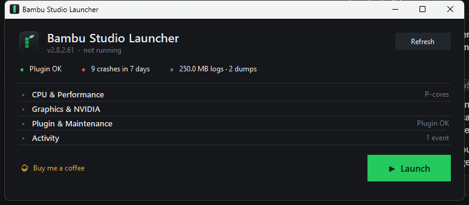

# Bambu Studio Launcher

A Windows control panel for Bambu Studio. It pins the application to selected
CPU cores, verifies the integrity of its network plugin, and applies the
documented remedies for the NVIDIA driver faults that crash Bambu Studio during
slicing.



## Download

Download `BambuStudioLauncher.exe` from the
[latest release](https://github.com/DjjC13/BambuStudioLauncher/releases/latest).

It is a single file. No installation, no Python, and no administrator rights
are required. All data is written within the current user profile.

> The executable is unsigned, so SmartScreen will warn on first run. Select
> **More info → Run anyway**, or build from source as described below.

## Features

- Applies a CPU affinity mask before the target process executes any code
- Detects and repairs partially applied Bambu network plugin updates
- Sets the Windows per-application GPU preference
- Reports the NVIDIA driver setting responsible for crashes during slicing
- Reads crash history from the Windows event log and decodes process exit codes
- Removes the crash dumps that Bambu Studio accumulates without limit

## Background

Bambu Studio was observed crashing on a test machine in nearly every session —
33 faults over three weeks, each with an identical signature:

```
Faulting module: bambu_networking.dll
Exception:       0xC0000005 access violation, READ
Fault offset:    +0xD5447A
```

The cause was a partially applied plugin update. Bambu Studio had staged an OTA
plugin package in `%APPDATA%\BambuStudio\ota\plugins` and applied it to every
DLL except `bambu_networking.dll`, which remained on an earlier build. The
resulting version mismatch caused the networking component to dereference an
invalid pointer on a worker thread.

The launcher checks for this condition before every launch.

## Usage

The window opens at 760 × 300 with a status line, four collapsed sections, and
the launch control. Selecting a heading expands that section and collapses any
other. Each collapsed heading displays a summary on the right.

| Section | Contents |
|---|---|
| **CPU & Performance** | Affinity presets, mask entry, priority, per-CPU grid |
| **Graphics & NVIDIA** | Adapter list, GPU preference, Threaded Optimization |
| **Plugin & Maintenance** | Plugin state, launch checks, repair actions |
| **Activity** | Log of launcher operations |

### Status indicators

| Indicator | Meaning |
|---|---|
| **Network plugin** | Compares each installed plugin DLL against the staged OTA copy by SHA-256 |
| **Crashes (7 days)** | Bambu Studio faults recorded in the Windows Application event log |
| **Log folder** | Total size and crash dump count. Dumps are approximately 50 MB each |

### CPU affinity

The mask is applied using `CREATE_SUSPENDED`, `SetProcessAffinityMask`, and
`ResumeThread`, so the process is constrained before it executes a single
instruction and all worker threads created during startup inherit the mask.

Presets are derived from the host topology through
`GetLogicalProcessorInformationEx`, which reports the efficiency class of each
core. Preset masks therefore differ between processors. The following are the
presets generated on an i9-14900KF, which provides 8 hyperthreaded P-cores
(CPUs 0–15) and 16 E-cores (CPUs 16–31):

| Preset | Mask | CPUs |
|---|---|---|
| `P-cores` | `0x5555` | 0, 2, 4, 6, 8, 10, 12, 14 — one thread per P-core |
| `P + HT` | `0xFFFF` | 0–15 — all P-cores including hyperthreads |
| `E-cores` | `0xFFFF0000` | 16–31 |
| `All 32` | `0xFFFFFFFF` | All processors |

On a processor without a hybrid topology, the presets reduce to `Half` and
`All`. Any mask may be set directly, either by selecting individual CPUs in the
grid or by entering a hexadecimal value; the two remain synchronised, and the
preset row highlights whichever preset matches the current mask.

**Priority** sets the process priority class and defaults to Normal.

### Graphics and NVIDIA

This section distinguishes between settings the launcher applies and settings
it can only report.

**Applied.** *Force the high-performance GPU for Bambu Studio* writes the
Windows per-application GPU preference to
`HKCU\Software\Microsoft\DirectX\UserGpuPreferences`. This is a documented,
user-scope, reversible registry value. It is relevant on portable systems and
on any machine carrying a virtual display adapter — Parsec, Sunshine, OBS, or a
KVM — alongside a physical GPU, as Bambu Studio is known to select the incorrect
adapter when several are present. Clearing the option removes the value.

**Reported only.** NVIDIA's *Threaded Optimization* is incompatible with Bambu
Studio's threading model and terminates the application during slicing. No
supported API exists for writing NVIDIA's driver profile database, which is an
undocumented binary store intended for use by the NVIDIA control panel alone.
The launcher therefore opens the appropriate application and states the
required change:

> NVIDIA Control Panel → Manage 3D Settings → Program Settings → add
> `bambu-studio.exe` → set **Threaded Optimization** to **Off**.

The section additionally reports the presence of the GeForce overlay
(`nvspcap64.dll`), which injects into Bambu Studio and is a recognised source of
instability in OpenGL applications.

References:
[Bambu Lab wiki](https://wiki.bambulab.com/en/bambu-studio/troubleshoot/win-crash-when-slicing),
[Bambu Lab community forum](https://forum.bambulab.com/t/bambu-studio-crashes-after-slicing-solved-nvidia-problem/162392).

### Plugin and maintenance

| Action | Description |
|---|---|
| **Sync plugin from OTA** | Copies stale or missing staged DLLs over the installed files, after taking a backup. Also refreshes `plugins\backup\` so that a failed load cannot revert to the defective build. |
| **Delete plugin (reinstall)** | Takes a backup, then removes the plugins directory. Bambu Studio offers to download a replacement on next launch. |
| **Restore backup** | Restores a previous plugin snapshot. |
| **Clean logs & dumps** | Retains the two most recent crash dumps and removes logs older than one day. |
| **Diagnostics report** | Writes a text report containing the application version, plugin inventory, log sizes, and a 30-day crash breakdown, suitable for submission with a bug report. |
| **Close Bambu Studio** | Terminates the process. |
| **Open data folder** | Opens `%APPDATA%\BambuStudio`. |

Maintenance actions are unavailable while Bambu Studio is running, as the
plugin DLLs are locked by the process.

Two options govern behaviour at launch. **Check plugin before launch** verifies
the plugin state and records the result in the activity log. **Auto-repair the
plugin if it is stale** additionally synchronises from the staged OTA package
before starting the application; it is disabled by default.

### Crash detection

The launcher retains a handle to the process and reports its exit code on
termination. Normal exits are logged as such; faults are logged with the
decoded status, for example `0xC0000005 - access violation`.

## Configuration

Settings are stored in `config.json`, written when the launcher closes.

| Context | Location |
|---|---|
| Executable | `%LOCALAPPDATA%\BambuStudioLauncher\` |
| Source | Alongside the scripts |

The directory also holds `backups/`, containing timestamped plugin snapshots,
and any generated `diagnostics_*.txt` reports. The separation exists because a
one-file executable unpacks to a temporary directory that Windows removes on
exit; settings written beside the executable would not persist.

To target a different Bambu Studio installation, edit the `exe` value in
`config.json`.

## Building from source

Requires Python 3.10 or later with tkinter, which the standard python.org
installer provides. The application itself depends only on the standard
library.

```
python bambu_launcher.py
```

To produce the distributable executable:

```
pip install pyinstaller
python build_exe.py
```

The result is written to `dist/BambuStudioLauncher.exe`.

PyInstaller does not produce reproducible output: build timestamps and archive
ordering are embedded in the executable, so a local build is functionally
identical to the published release but will not match its checksum. The
SHA-256 published with each release verifies the downloaded asset only.

### Repository layout

```
bambu_launcher.py    User interface
bambu_core.py        Process launching, plugin checks, log cleanup, event log
build_exe.py         PyInstaller build script
Bambu Launcher.bat   Runs from source without a console window
make_icon.py         Generates icon.ico and icon.png (requires Pillow)
logo_options.py      Renders candidate icon designs for comparison
```

## Notes

- Restricting cores trades slicing throughput for stability and lower system
  load. If slicing is slower than acceptable, select a broader preset or
  disable **Limit CPUs**.
- `plugins\backup\` is Bambu Studio's own rollback copy. The sync action
  refreshes it; a manual DLL replacement does not, and a subsequent rollback
  could therefore reinstate an earlier build.
- `BambuStudio.conf` is never modified, so printer profiles, access codes, and
  application preferences are unaffected.
- The icon is generated by `make_icon.py` at eight times the target size and
  downsampled. Below 24 pixels the leaf is omitted and the stalk enlarged, as
  controlled by `SIMPLIFY_BELOW`.
- **Buy me a coffee** opens <http://buymeacoffee.com/DjjC13>.

## License

MIT. See [LICENSE](LICENSE).
